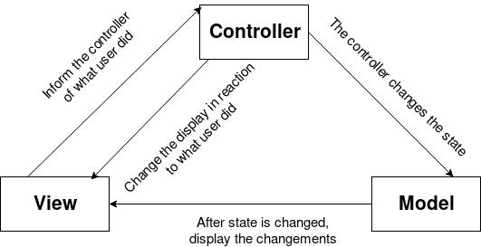
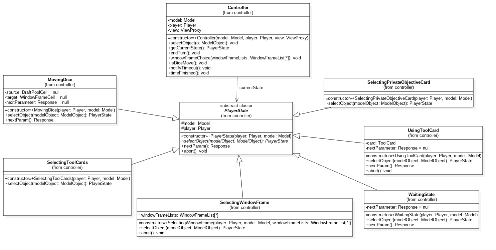
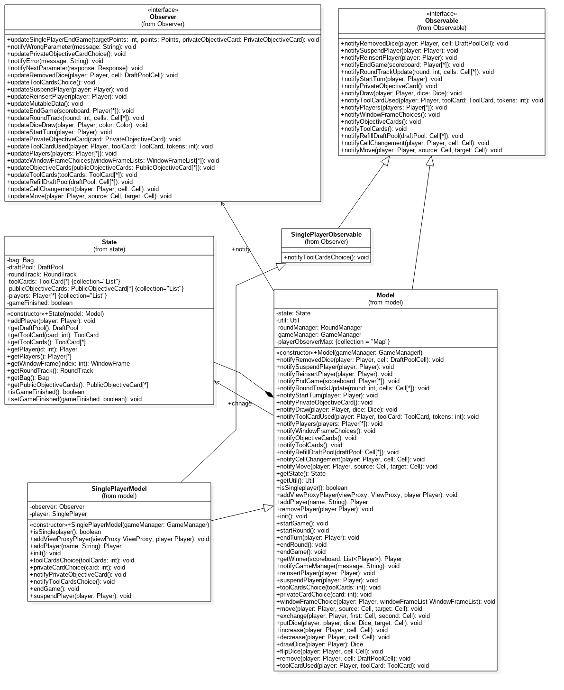
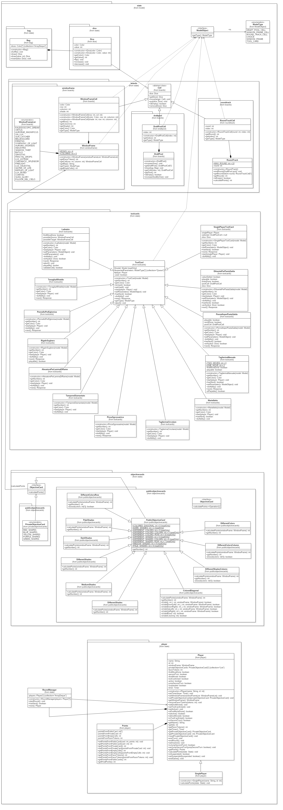
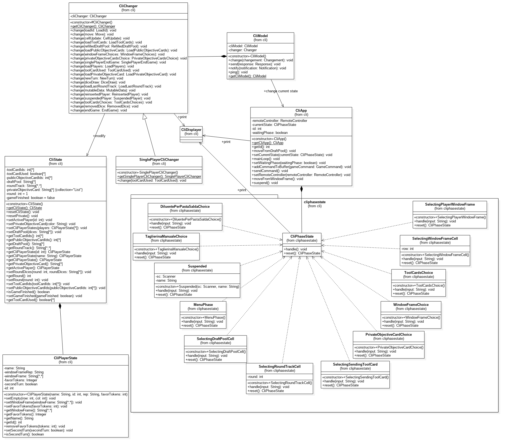

## Sagrada #

This is the repository for the java implementation of the board game *[Sagrada](http://floodgategames.com/Sagrada/)*. This project is part of the final test in Software Engineering 2018 course at Politecnico di Milano.

## General info ##

### Contributors: ###
* Andrea Scotti (846630)
* Vincenzo Santomarco (846442)
* Gabriele Stucchi (847482)

### Repository folders: ###

* **src/main:** contains the java source code of the application.
* **src/test:** application unit tests using junit.
* **lib:** contains the compiled sources of external libraries.
* **configurations:** contains the configurations files.

## Usage info ##

#### Start the server launcher ####

In order to play you first need to start the server, to do that run `src/main/java/server/LaunchServer.java`, it will start automatically and wait for incoming RMI or Socket connections.

#### Start the client launcher ####

* ##### Cli Launcher ##### 

    If you want to play in the CLI environment run `src/main/java/client/view/cli/CliLaunchClient.java`.

* ##### Gui Launcher #####

    If you want to play in the CLI environment run `src/main/java/client/view/gui/MainApp.java`.

#### Single Player ####

#### MultiPlayer ####

When the first player connects to the server, a new waiting room will be created, following players will be automatically placed in the same waiting room. When at least two people joined the same waiting room a countdown of 15 seconds starts: if the countdown does reach 0 a new game will be created, if someone else join the room during the countdown he is added to the game. When the room reaches the maximum of 4 players the game will start instantly.

#### Concurrent Games  ####
The game manager supports multiple concurrent games. When a game starts new incoming players will be put in another waiting room, and a new game will start with the same rules as before.

## Implementation details ##

The whole architecture of the application follows the **MVC** pattern:
* the **MODEL** holds all the state and the application logic
* the **VIEW** displays the state to the user and it gets updated when the state changes
* the **CONTROLLER** maps the user input from the view to methods to call on the model in order to change its state

## Controller ##

Controller is implemented with a **STATE PATTERN**, where the class *Controller* refers to the *PlayerState* interface, as *currentState*, for performing the *selectObject(ModelObject o)* operation.
In this way *Controller* is independent of how state-specific behavior is implemented. The *currentState* is updated every time a *selectObject(ModelObject o)* finishes, by retrieving is returned value.

## Model ##

The class *Model* contains:
* a reference to the *State*
* all the methods that can be called by *Controller* to change the *State*
* a list of *Observer*s;

This class inherit from the interface *Observable* all the methods which notify the *Observer*s of this class about a change of the state.

## View ##

### Cli ###

Cli is implemented with a **STATE PATTERN**, where the class *CliApp* refers to the *CliPhaseState* interface, as the *currentState*.
A loop inside *CliApp* keeps waiting for user input and it's handled by the current state. 

### Gui ###

