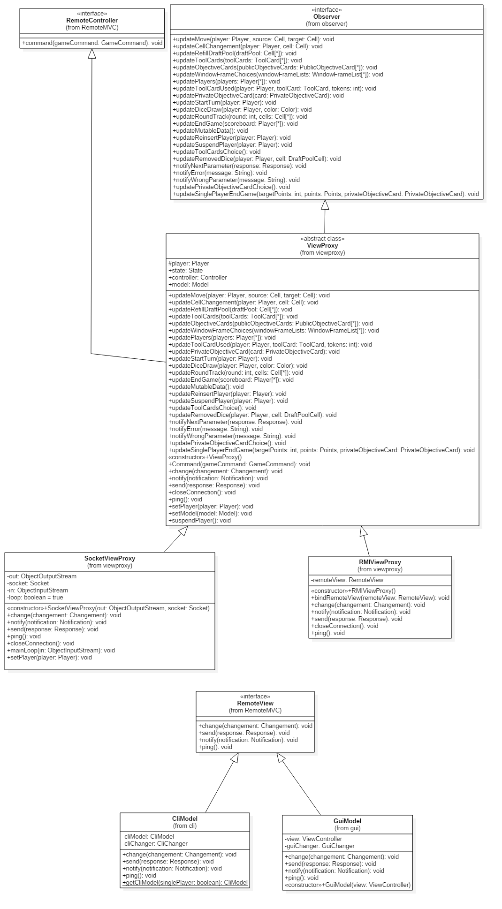

## Sagrada #

This is the repository for the java implementation of the board game *[Sagrada](http://floodgategames.com/Sagrada/)*. This project is part of the final test in Software Engineering 2018 course at Politecnico di Milano.

## General info ##

### Contributors: ###
* Andrea Scotti (846630)
* Vincenzo Santomarco (846442)
* Gabriele Stucchi (847482)

### Repository folders: ###

* **src/main:** contains the java source code of the application.
* **src/test:** application unit tests using junit.
* **lib:** contains the compiled sources of external libraries.
* **configurations:** contains the configurations files.

## Usage info ##

#### Start the server launcher ####

In order to play you first need to set the values of timeouts and ip in the configuration file **/lib/server_settings.json**.
Then start the server, to do that run `java -jar server.jar`, it will start automatically and wait for incoming RMI or Socket connections.

#### Start the client launcher ####

Before playing remember to set the values of the server ip in the configuration file **/lib/client_settings.json**.
* ##### Cli Launcher ##### 

    If you want to play in the CLI environment  run `java -jar cliClient.jar`.

* ##### Gui Launcher #####

    If you want to play in the GUI environment run `java -jar guiClient.jar`.

#### MultiPlayer ####

When the first player connects to the server, a new waiting room will be created, following players will be automatically placed in the same waiting room. When at least two people joined the same waiting room a countdown is set: if the countdown does reach 0 a new game will be created, if someone else join the room during the countdown he is added to the game. When the room reaches the maximum of 4 players the game will start instantly.

#### Concurrent Games  ####

The game manager supports multiple concurrent games. When a game starts new incoming players will be put in another waiting room, and a new game will start with the same rules as before.

#### Single Player ####

When the player starts the game it can choose to play alone with some difference in the rules.

## Implementation details ##

The whole architecture of the application follows the **MVC** pattern:
* the **MODEL** holds all the state and the application logic
* the **VIEW** displays the state to the user and it gets updated when the state changes
* the **CONTROLLER** maps the user input from the view to methods to call on the model in order to change its state

## Controller ##

Controller is implemented with a **STATE PATTERN**, where the class *Controller* refers to the *PlayerState* interface, as *currentState*, for performing the *selectObject(ModelObject o)* operation.
In this way *Controller* is independent of how state-specific behavior is implemented. The *currentState* is updated every time a *selectObject(ModelObject o)* finishes, by retrieving is returned value.

## Model ##

The class *Model* contains:
* a reference to the *State*
* all the methods that can be called by *Controller* to change the *State*
* a list of *Observer*s;

This class inherit from the interface *Observable* all the methods which notify the *Observer*s of this class about a change of the state.

## View ##

### Cli ###

Cli is implemented with a **STATE PATTERN**, where the class *CliApp* refers to the *CliPhaseState* interface, as the *currentState*.
A loop inside *CliApp* keeps waiting for user input and it's handled by the current state. 

### Gui ###

## MVC examples ##

In these examples we shortly describe the MVC communications.
In the first one it's shown what happens when user wants to use a *ToolCard*. The view send a *GameCommand* to the *ViewProxy* which translates it in a real *ToolCard* and pass it to the *Controller*. In this case the current state of the controller is *WaitingPhase*, that, by recognizing the *ToolCard*, will initialize a new *UsingToolCard* state that will store this *ToolCard* to manages the next operations of the user. The *Controller* asks to the *ToolCard* which is the next expected parameter and this will be notify to the user by the *ViewProxy*.

In the second one it's shown what happens when user sends the last parameter expected from the *ToolCard* but this one can't be used. When the *ToolCard* recognizes that this parameter is the last one needed, it calls the method *doAbility* which realizes all the effects of the *ToolCard* on the state. Some information are requested to the *Model* (this passage is not shown on the diagram) and then the *ToolCard* throws an InvalidMoveException that is notify as an error message to the *ViewProxy*.

## Network ##

### Limitations ###

Unfortunately, with this implementation, if a client connected in RMI gets disconnected from the network, while the server calls a method on a remote object of this client, the game can't manage to continue because it's stuck to wait the return value of this method. 

## Testing ##

### Sonar screens

